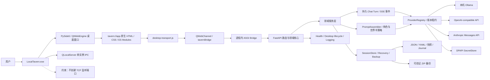
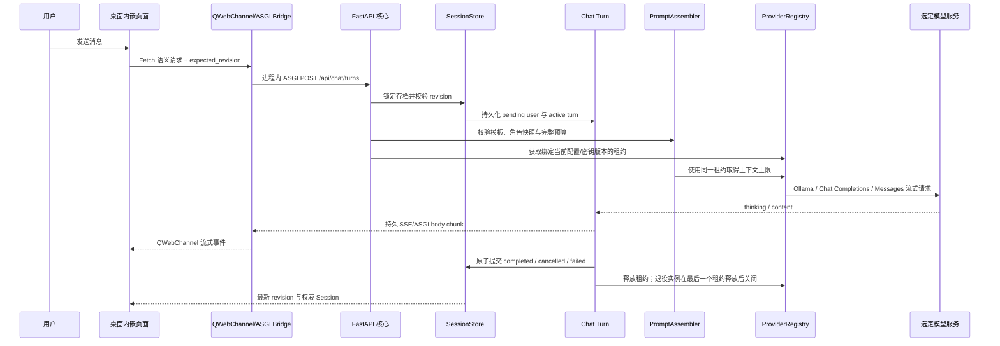

# 本地酒馆 — 完整项目文档

> **文档版本**：最终发布版 v4.9（2026-08-09）  
> **项目位置**：`C:\local-tavern`  
> **桌面程序**：`C:\local-tavern\release\LocalTavern\LocalTavern.exe`  
> **实现基线**：当前提交 `21c07b731bf5381eac9d22e2a104d19d4ebc7942`；标记 `v1.0.1` 仍指向上一发布基线 `0f7e92619c4041564fd0153c08734a854b22467b`；当前 Git 工作区干净  
> **项目状态**：全部规划工作包已落地；沉浸式工作台、叙事/角色双模块、结构化好感度、云端 API、无端口桌面运行时、稳定软件渲染、可预览故障报告、五个独立世界构成模块，以及长模型名安全收缩的顶部工具栏均可用  
> **发布状态**：正式 release 质量门 55/55 通过，`release_ready:true`；已完成固定浏览器九宽度视觉验收、axe、冷构建、无端口 smoke 与两阶段 EXE 滚动旅程  
> **文档定位**：项目目的、功能、架构、实现、使用、维护、安全与验收的唯一桌面权威文档

---

## 1. 文档目的与阅读方式

本文档服务三类读者：

- **使用者**：了解软件能做什么，如何安装、启动和日常使用。
- **维护者**：了解数据放在哪里，如何备份、恢复、排错和安全操作。
- **开发者或 AI 协作者**：了解系统架构、关键实现、不变量、测试门禁和接手顺序。

推荐阅读路径：

- 第一次使用：先看下方“一分钟摘要”，再读第 11–13 节。
- 了解功能：阅读第 2–3 节。
- 排查或恢复：阅读第 15、18、22 节。
- 修改功能：阅读第 4–10、16–19 节。

本文档替代桌面原《本地酒馆搭建-AI上下文.md》和《本地酒馆-功能优化规划.md》。已经完成的优化任务不再单独维护规划状态，关键成果统一写入本文档的实现与验收章节。

### 1.1 一分钟摘要

| 问题 | 当前答案 |
|---|---|
| 能否直接使用 | 能。保留完整 `release\LocalTavern` 目录，双击 `LocalTavern.exe`。 |
| 是否要启动酒馆服务 | 不需要。桌面程序通过 QWebChannel 调用进程内 ASGI，不监听 TCP 端口。 |
| 是否有自己的 UI | 有。PySide6 提供桌面外壳，QtWebEngine 渲染安装包内自带的 `web/` UI；不是外部网站。 |
| 模型从哪里来 | 本机 Ollama，或用户显式配置的 OpenAI-compatible / Anthropic 云端 API。 |
| 数据放在哪里 | `%LOCALAPPDATA%\LocalTavern`；项目、存档、备份、日志与密钥分目录保存。 |
| 当前是否有未完成任务 | 没有。当前功能、Debug、视觉验收、EXE 重建和文档落档均已完成。 |
| 当前发布限制 | Windows onedir、未做商业代码签名、没有自动更新器；EXE 不能脱离 `_internal` 单独复制。 |

---

## 2. 项目目的、定位与边界

### 2.1 项目是什么

本地酒馆是一套运行在 Windows 本机的 **AI 多角色同场角色扮演桌面应用**。正式版本由 PySide6/QtWebEngine 提供原生桌面窗口，内嵌页面通过 QWebChannel 调用进程内 FastAPI/ASGI 核心，不启动 Uvicorn、不监听 TCP 端口，也不要求用户安装 Python、启动服务或打开浏览器。推理入口可选择本机 Ollama、OpenAI-compatible 服务或 Anthropic 原生 Messages API，业务数据使用本地 JSON/YAML 文件保存。

- 多个 AI 角色在同一场景中存在并互相接话。
- 用户扮演一个明确身份，而不是只与单个机器人对话。
- 每轮输出遵循统一结构：剧情推进、角色回应、可折叠状态细节与行动建议；低频场景元数据按变化展示。
- 角色卡、世界书、用户档案、Prompt、模型参数和存档均可由用户控制。
- 对话、设定、备份和日志默认保存在本机；只有用户明确选择云端 Provider 时，本轮所需上下文才发送给对应服务商。
- 长线剧情具备原文快照、摘要、钉选消息和恢复机制。

### 2.2 产品原则

| 原则 | 具体含义 |
|---|---|
| 直接使用 | 保留完整发布目录后双击 `LocalTavern.exe`；应用自身承载界面与业务核心。 |
| 本地优先 | 默认保留 Ollama 本地入口；云端能力必须由用户显式配置和选择。 |
| 多角色同场 | 角色可主动发言、沉默、互相回应，不强制每轮凑齐人数。 |
| 数据可控 | 设定、状态、Prompt、参数和存档均可查看、编辑、导出和恢复。 |
| 失败不毁数据 | 冲突、取消、断线、模型错误和服务重启都有明确终态与恢复路径。 |
| 不猜身份 | 角色和消息使用稳定 ID；碰撞或未知身份会拒绝或跳过。 |
| 可复现发布 | Python、Node、浏览器和测试工具均有精确版本及制品校验。 |

### 2.3 明确不做的事情

- 不引入 RPG 数值规则引擎或自动 NPC 生成器。
- 不在未选择云端 Provider 时外发剧情数据，不在后台擅自探测云端或自动切换来源。
- 不主动编写具体角色内容、剧情或范例对话；项目只提供机制、Schema 和工具。
- 不通过模型输出自动制造角色关系事实。
- 不在读取数据时自动迁移、隔离或删除文件。
- 不在生产前端引入构建链或 npm 运行依赖。

### 2.4 信任边界

正式桌面模式没有 HTTP 监听，也没有可从浏览器访问的应用端口。页面只从受限的 `tavern://app` 自定义 scheme 加载，并通过 QWebChannel 调用同一进程内的 ASGI 核心；单实例协调使用 Windows 本地 IPC，不是 TCP。保留的 Uvicorn/浏览器入口只供开发调试，并固定接受回环地址；非回环监听被拒绝，`TAVERN_ALLOW_REMOTE=true` 也不能放宽这一边界。Provider 写接口继续校验 Host 与同源请求。

使用 Ollama 时仍需本机 Ollama 进程提供模型推理，但这不是“本地酒馆后端服务”，也不影响桌面程序独立启动；推理数据停留在本机模型服务边界内。选择云端 Provider 时不需要 Ollama，对应服务商及其数据处理条款进入信任边界；API Key 由当前 Windows 用户的 DPAPI 保护，因此 Windows 账户与系统安全同样属于外层信任边界。

备份 manifest、ZIP、哈希和 journal 用于发现非预期损坏、路径越界和未完成事务；它们不用于抵抗能够同时修改本机数据与校验记录的本地管理员。本机 Windows 账户安全是外层信任边界。

---

## 3. 功能总览

### 3.1 项目与设定管理

- 创建、切换和删除项目，至少保留一个项目。
- 每个项目拥有共享角色、我的角色和世界设定。
- “角色、关系、世界设定、我的角色、存档”保持五个独立入口；每次只打开所选模块，不增加统一外框或总控页。
- 五个模块只共享深色静态面板、暖金强调色、间距、圆角、状态和 44px 操作目标，内容结构分别针对任务设计。
- 角色卡表单由后端 Schema 驱动；默认只显示角色名、别名、定位和详细人设，外貌、说话方式、初始状态、排序及自定义字段按需展开，内部 ID 自动生成且不在默认界面出现。
- 中文显示名只在创建或重命名时转换为稳定 ID；后续引用使用 API 返回的 ID。

### 3.2 多存档与剧情管理

- 每个项目可创建多个独立存档，形成不同时间线。
- 支持存档重命名、删除、导入、导出和重置。
- 顶部“存档”入口打开独立故事存档模块；当前存档显示模型、消息数、更新时间、重命名、导出和回收操作，其他存档以卡片形式直接切换。
- 删除进入可验证回收区，不直接静默消失。
- 重命名、重置和快照恢复前创建 checkpoint。
- 支持查看、预览和恢复历史快照。
- 所有存档修改使用 revision CAS，陈旧页面不会覆盖新数据。

### 3.3 多角色流式聊天

- 统一 Provider 协议支持 Ollama、OpenAI-compatible Chat Completions 和 Anthropic 原生 Messages API。
- 三类来源统一转换为 `thinking`、`content`、`done` 与安全错误事件。
- 每个聊天请求先持久化 pending user，再返回可查询的 turn。
- turn、消息与 Session 同时保存 `provider` 和 `model`，切换时作为一组原子状态处理。
- 支持服务端取消、断线重连、事件 cursor 重放和刷新恢复。
- completed、cancelled、failed 三类终态互斥且只出现一次。
- 失败或取消保留用户输入和已生成 partial，partial 默认不进入下一轮 Prompt。
- 同一存档同一时间只允许一个 active turn。
- 完成的 assistant 消息持久化 `presentation.schema_version=1` 展示快照；实时生成、刷新、切换存档、切换项目和服务进程重启后均使用同一套剧情/角色模块。
- 展示快照保存权威好感度、本轮前好感度、角色心情和本轮场景变化；旧消息没有快照时只读解析原文，不迁移、不回写。

### 3.4 消息操作

- 按稳定 UUID 编辑、删除、钉选和排除 Prompt。
- 支持从指定消息截断，截断时保留 cutoff 后的 pinned 消息。
- 支持原子重生成：定位源消息、创建一次快照、截断并启动新 turn 在同一事务中完成。
- 消息编辑冲突后重新载入 Session，并按 UUID 恢复未保存草稿。
- 编辑结构化 assistant 消息时进入原始模型文本；按 Escape 取消会完整恢复模块 DOM，且 revision、消息正文和展示快照均不发生写入。

### 3.5 Prompt 与模型参数

- 在界面编辑 `system.md`、`group_chat.md` 和摘要模板。
- system 只承载静态规则；动态数据只进入 group_chat 的固定槽位。
- Ollama 自动探测模型上下文上限，并与实际 `num_ctx` 使用同一数值。
- 云端协议缺少统一上下文元数据接口，使用用户配置值；默认 32768，允许 4096–1048576。
- 输入预算固定为 `context_limit - num_predict - safety_margin`。
- 每加入一类可选来源都重新计算完整 Prompt，超限时按规则裁剪。
- 提供不含正文的安全诊断，解释来源为何被保留或裁剪。

### 3.6 长期记忆与摘要

- 对话截断前创建原文 trim 快照。
- 成功回合截断时创建与原文一一绑定的摘要段。
- 摘要支持查看原文、人工编辑、重生成和失败重试。
- 摘要任务使用 `generation_id`，旧任务不能覆盖新任务或人工修改。
- 自动摘要继承并冻结触发该轮聊天的 Provider 实例版本；改配置或换密钥不会中途切换摘要来源。
- 手动重生成使用当前 Session 的 Provider/model，并在启动前校验该 Provider 的权威模型列表。
- 未分类摘要异常只写内部日志，对外与存档统一为安全通用提示。
- pinned 消息作为显式长期记忆，不受普通截断删除。

### 3.7 世界设定与世界状态

- 支持 `always`、`keywords`、`manual`、`scene` 四种激活方式；`scene` 可按地点别名或当前活跃角色关联自动生效。
- 关键词按 NFKC + casefold 做字面匹配，不把用户文本构造成正则。
- 匹配范围限定为本轮输入、近期有效 turn、场景标量和活跃角色身份。
- 候选按优先级、命中词数量、最近性和稳定 ID 排序后进入 Prompt 预算。
- 项目共享条目配置与当前存档 manual 选择分开保存。
- 条目具有类别、摘要、公开/已发现/隐藏可见性、全局/旁白/指定角色知识边界、角色关联和条目关联。
- 每个存档单独保存已发现条目与世界变化；变化记录可引用证据消息，进入下一轮 Prompt 的 `scene_meta.world_state`，不会改写项目共享世界书。
- 主界面常驻的是一行“世界状态”摘要，不再把地点大块常驻在对话区；左侧“世界设定”是五个顶层模块之一，与角色、关系、我的角色和存档互不合并。
- 世界设定模块内部提供“世界设定 / 当前世界变化 / 设定关联”三种视图；它们只服务世界资料，不构成五个模块的通用框架。
- 世界设定默认采用双栏结构：左侧搜索、类型筛选和设定列表，右侧编辑。表单只先展示“基本内容、详细设定、什么时候参考、谁知道这件事”，关联和专业设置折叠；内部标识自动生成，无需手写 ID。
- “使用情况”折叠显示最近一轮是否参考了设定；默认列表只展示名称、简短介绍、类型和参考时机，不展示优先级、Prompt 注入或 UUID 等实现术语。
- 当前世界变化采用存档时间线；变化可新增、编辑、删除并在“生效中 / 已解决 / 已推翻”之间流转，可关联世界设定与对话证据。发现状态可以勾选或撤销，不会污染同项目其他存档。
- 设定关联从世界设定的设定关联和角色关联自动生成，支持图形/语义列表、类别筛选、搜索和节点深链编辑；地点、势力、规则、历史、文化、物品与秘密使用不同语义色，同时保留文字类别。
- 助手消息可直接“记录为世界变化”；本轮世界影响标签和诊断命中 ID 可跳转到对应设定或证据消息。

### 3.8 角色节奏、状态与禁言

- `chattiness` 为 0–100 的发言倾向权重，不是发言人数配额。
- `remaining_silent_turns` 表示剩余成功新轮次；只有 completed 普通聊天会递减。
- turn 接受时冻结可发言角色集合，生成和写回复用同一快照。
- 严格模式可跳过被禁言角色的模型越界写回。
- 角色身份按稳定 ID、卡名、存档名和唯一 alias 解析；碰撞不猜。
- affinity 全链路限制为 0–100，单轮变化限制为 ±10。

### 3.9 全局剧情搜索

- 搜索当前项目全部权威存档中的消息正文和摘要结构字段。
- 支持 all、messages、summaries、pinned 范围。
- 不扫描 `.history`，不建立索引，不迁移存档。
- 匹配前执行凭据、URL userinfo、PEM 和常见令牌脱敏。
- 搜索结果携带稳定 UUID，可跨存档精确定位。

### 3.10 角色关系图

- 关系以人工维护的有向 `relationship_edges` 为唯一事实源。
- 支持关系类型、强度、证据消息和更新时间。
- SVG 图与语义列表共享同一结构化模型。
- 每条关系必须引用当前存档消息证据。
- 编辑界面用“谁的态度 / 看待谁 / 关系类型 / 亲近程度”描述有向关系；强度同时显示“疏远、普通、亲近、深厚”和精确数值，证据只显示对话序号、角色与正文摘要，不暴露内部 UUID。
- 删除或截断证据时自动收敛关系；证据清空则删除对应边。
- 不从 affinity、mood、摘要或模型输出推断关系。

### 3.11 备份、恢复与迁移

- 创建带 manifest 和 SHA-256 的全量 ZIP 备份。
- 恢复前执行 dry-run，显示差异、冲突和确认要求。
- 正式恢复前自动创建 `pre_restore` 备份。
- 多根切换使用持久 journal，硬退出后可恢复。
- 默认每 24 小时检查备份，每 7 天执行隔离恢复演练。
- 保留策略只生成删除计划；永久删除必须提交计划指纹与显式确认。
- 旧目录迁移先计划、备份、校验并发布，旧源默认保留。

### 3.12 可访问性与响应式界面

- 主界面改为深色编辑型三栏工作台：左侧世界与存档导航、中间剧情阅读/输入区、右侧角色与场景检视器。
- 顶部剧情提要默认折叠；收起时只保留主线与下一步，展开后才显示地点、时段、天气和用户状态。
- 每条结构化回复固定按“剧情推进 → 角色回应”排列：剧情使用暖金/棕色模块，角色使用紫色模块，颜色、标题与语义结构共同区分信息类型。
- thinking 以消息内折叠区呈现，不再与正文混成一整块；角色心情、内心、穿着和姿势归入默认折叠的“状态与细节”。
- 地点、时段和天气只在相对上一份权威 Session 发生变化时进入对话正文，未变化时不重复占用阅读空间。
- 好感度同时显示精确数值、关系阶段、可确认的本轮变化与语义进度条；右侧角色面板复用相同指标。
- 顶部“模型来源”入口集中管理 Ollama、OpenAI、DeepSeek、SiliconFlow、Anthropic 与自定义服务。
- 来源缺失、模型失效、无模型和连接失败均显示明确恢复状态，绝不静默回退到 Ollama。
- Modal 支持正反向焦点圈闭、Escape 和触发点恢复。
- 项目下拉使用键盘 listbox 模型；存档改为独立对话框，避免把创建、导入、改名、导出和删除挤进下拉菜单。
- 五个世界构成模块拥有各自的信息架构：角色为列表+表单，关系为概览+证据编辑，世界设定为资料库+时间线+关联，我的角色为全宽单档表单，存档为故事进度卡片；视觉语言统一但不共享可见容器。
- 触控目标不低于 44px，支持 `focus-visible` 和 `reduced-motion`。
- 布局按 ≥1600px、1440–1599px、900–1439px、<900px、<600px 多级收敛；375、768、899、1024、1280、1366、1424、1440、1600px 自动验收无横向溢出或顶栏碰撞。
- 中央工作区使用显式 `minmax(0, 1fr)` 网格轨道和受约束的输入栏宽度；自动验收同时检查发送按钮右边界、可点击命中点与右侧检视器遮挡，防止高 DPI 或临界宽度下输入栏被裁切。
- 流式文本按动画帧合并，历史消息使用单个 DocumentFragment 挂载。
- 外部文本只通过 `textContent`、`value` 和 DOM 属性渲染。

### 3.13 首次引导、运营工具与回复管理

- 首次运行显示分步引导：选择“完全本地”或“云端 API”，明确说明每种模式的数据边界；完成标记只保存在本机，也可从帮助入口重新打开。
- 备份中心在界面内完成创建备份、差异 dry-run、隔离恢复演练和正式恢复；正式恢复要求输入确认文本，并在写入前创建 `pre_restore` 备份。
- 诊断中心展示版本、运行时、当前来源、渲染模式、数据健康与脱敏错误摘要；旧称“脱敏包/支持包”的功能现统一命名为“故障报告”。报告必须先完整预览，再由用户决定是否导出 JSON。
- 故障报告只包含应用版本、运行环境、渲染模式、健康状态、备份数量、模型来源类型和稳定错误码；不包含对话正文、角色设定、世界书正文、Prompt、API Key、云端地址或本机文件路径。
- 剧情记忆支持人工备注的创建、修改、删除、角色关联与 revision 冲突保护；人工备注与模型摘要分层保存，不会被自动摘要覆盖。
- 每条完成回复可查看生成详情，包括 Provider、模型、上下文预算、裁剪来源、耗时和用量；诊断元数据不复制 Prompt 正文。
- 普通聊天可保留多个回复备选并稳定切换当前展示；刷新、存档切换和桌面重启后仍保持选择，历史消息重生成不会篡改已经提交的权威状态。

---

## 4. 系统架构

### 4.1 总体架构图



正式运行的数据通路是 `tavern://app → QWebChannel → AsgiBridge → FastAPI route/core`。FastAPI 在这里是可复用的应用核心和路由契约，不等于必须单独启动的网络服务。开发者仍可运行旧 Uvicorn 浏览器模式，前端 transport 会在普通浏览器中使用原生 `fetch`；正式桌面模式禁止回退 HTTP。

### 4.2 后端分层

| 层 | 主要职责 | 代表文件 |
|---|---|---|
| 桌面运行与基础设施 | Qt 生命周期、自定义 scheme、QWebChannel、进程内 ASGI、单实例、迁移、日志 | `desktop/*.py`、`core/config.py`、`core/health.py` |
| API/ASGI 路由 | 参数校验、错误合约、调用领域服务；桌面和开发浏览器共用 | `routes/*.py`、`core/api_errors.py` |
| 开发浏览器启动 | Uvicorn、PID、端口与旧 launcher；不属于最终用户启动链 | `server.py`、`core/launcher.py` |
| 会话与事务 | revision CAS、锁、原子写、恢复点 | `core/session_store.py`、`core/session_manager.py` |
| 聊天状态机 | active turn、事件日志、取消、重连、终态 | `core/chat_turns.py`、`core/active_turns.py` |
| 模型来源 | Provider 配置、版本租约、模型枚举、协议适配 | `core/model_provider.py`、`core/provider_registry.py`、`core/providers/*` |
| 密钥与请求安全 | DPAPI、云端 URL/SSRF 边界、Host 与同源校验 | `core/secret_store.py`、`core/request_security.py`、`routes/providers.py` |
| Prompt 与策略 | 预算、世界书、角色节奏、消息选择 | `core/prompt_assembler.py`、`core/worldbook_policy.py`、`core/roleplay_policy.py` |
| 记忆与关系 | 摘要生命周期、搜索、结构化关系 | `core/summary_lifecycle.py`、`core/search_service.py`、`core/relationship_edges.py` |
| 灾备与迁移 | checkpoint、trash、quarantine、备份、迁移 | `core/recovery_store.py`、`core/backup_store.py`、`core/migration_service.py` |

### 4.3 前端架构

生产前端不需要构建：`web/app.mjs` 是唯一业务入口，其他原生 ES modules 按职责拆分。桌面程序和开发浏览器复用同一套页面。

程序拥有自己完整的 UI。它采用“原生桌面外壳 + 内嵌本地 Web UI”的混合桌面架构：PySide6 创建窗口、单实例与系统级运行环境，QtWebEngine 只负责渲染安装包内自带的 `web/` 页面，所有图标、样式和交互代码都随 EXE 发布目录打包。正式桌面模式不打开外部浏览器、不访问网页服务器，也不需要用户启动本地酒馆服务；界面通过 `tavern://app` 与 QWebChannel 直接连接同一进程内的业务核心。这里的 HTML/CSS/JavaScript 是程序自身界面实现，不是依赖第三方网站的“套壳网页”。

- `desktop-transport.js`：在桌面模式将 Fetch 语义映射为 QWebChannel/ASGI 事件流，在普通浏览器中使用原生 HTTP fetch；支持流式 body、取消、错误和请求 ID。
- `api-client.js`：统一 HTTP 成功、错误、超时、Abort 和 Schema 处理。
- `session-ref.js`：不可变 `SessionRef(project, save, epoch)` 与迟到响应保护。
- `turn-client.js`：创建 turn、SSE cursor 重连、取消和终态恢复。
- `modal.mjs`、`listbox.mjs`：可访问性、焦点和键盘交互。
- `frame-renderer.mjs`：流式内容按帧提交。
- `conversation-view.mjs`：消息、内嵌 thinking、语义化对话结构与共享好感度指标。
- `response-presentation.mjs`：展示快照规范化、旧原文兼容解析、同 revision 重放基线恢复。
- `provider-settings.mjs`：Provider 配置、密钥、测试、模型刷新、切换与恢复状态。
- `icons.mjs`：本地 SVG 图标工厂，不依赖在线字体或图标服务。
- `styles/workspace.css`：三栏工作台、剧情/角色视觉层级、折叠提要、多级响应式布局、顶部工具边界和 Provider 状态样式。
- `search.mjs`：搜索、严格响应校验和跨档定位。
- `relationships.mjs`：关系 SVG、语义列表、编辑和证据定位。
- `worldbook.mjs`、`roleplay.mjs`：世界书和角色节奏配置。

### 4.4 聊天端到端流程



关键顺序：模板或预算错误必须在接受 turn、写 Session、写快照和调用模型之前拒绝；模型校验、上下文预算和完整生成固定使用同一 Provider 版本；终态提交前先冻结展示基线，状态写回后以权威 Session 数值生成展示快照；前端随后重新读取权威 Session，再解除当前存档写锁。

桌面生命周期还执行以下工作：启动前识别正在运行的旧 Uvicorn，拒绝复制活动数据；首次正常启动将旧 `data`、`backups` 和缺失的 Prompt 复制到 `%LOCALAPPDATA%\LocalTavern`，逐文件校验且不删除源；窗口关闭时取消桥请求，执行 FastAPI lifespan shutdown，等待 Provider、聊天、摘要和备份调度器收口后退出。

---

## 5. 技术栈与环境

| 维度 | 选型 |
|---|---|
| 最终用户平台 | Windows 11，独立 onedir 桌面发布 |
| 桌面运行时 | PySide6 6.11.1：QtWebEngine、QtWebChannel、QtNetwork |
| 打包 | PyInstaller 6.21.0，`LocalTavern.exe` + `_internal` 完整目录 |
| 开发语言 | Python 3.12 |
| 应用核心 | FastAPI 0.115.0；Uvicorn 0.32.0 仅用于浏览器开发模式 |
| 数据校验 | Pydantic 2.9.0 |
| 模型通信 | HTTPX 0.27.0；Ollama NDJSON、OpenAI-compatible SSE、Anthropic Messages SSE |
| YAML | PyYAML 6.0.1 |
| 前端 | 原生 HTML、CSS、JavaScript ES modules；QWebChannel/HTTP 双 transport |
| 数据存储 | JSON、YAML、NDJSON、ZIP，无数据库 |
| Python 测试 | pytest 8.3.5、pytest-asyncio 0.25.3、coverage 7.15.2、Ruff 0.15.22 |
| 浏览器测试 | Node 24.15.0、npm 11.12.1、Playwright 1.61.1、axe 4.12.1 |
| 固定浏览器 | Chromium 149.0.7827.55，Playwright revision 1228 |

最终用户无需安装 Python、Node 或浏览器。生产页面保持零 npm 运行依赖；Node 和 Playwright 只用于开发与发布验收。PySide6、Python 解释器、QtWebEngineProcess 和所需资源均包含在发布目录内。

---

## 6. 项目目录与关键文件

```text
C:\local-tavern\
├── server.py                    # 浏览器开发模式的 FastAPI 入口
├── desktop\                     # 正式桌面入口、Qt、ASGI 桥、迁移、单实例
│   ├── __main__.py / main.py
│   ├── asgi_bridge.py / qt_bridge.py / runtime.py
│   ├── scheme.py / resources.py / migration.py
│   ├── legacy_guard.py / single_instance.py
│   └── selfcheck.py / errors.py
├── packaging\LocalTavern.spec   # PyInstaller onedir 规格
├── setup_desktop.bat            # 创建精确桌面构建环境
├── build_desktop.bat            # 构建发布目录与 manifest
├── setup.bat                    # 旧浏览器开发环境
├── start.bat / run_hidden.vbs   # 旧浏览器开发入口
├── stop_tavern.bat              # 旧 Uvicorn 开发服务停止入口
├── README.md
├── .python-version / .node-version
├── requirements.txt
├── requirements.lock.txt
├── requirements.hashes.txt
├── requirements-dev.txt
├── requirements-dev.lock.txt
├── requirements-dev.hashes.txt
├── requirements-desktop.txt
├── requirements-desktop.lock.txt
├── requirements-desktop.hashes.txt
├── package.json / package-lock.json
├── core\
│   ├── model_provider.py / provider_registry.py
│   ├── secret_store.py / request_security.py
│   └── providers\ollama.py / openai_compatible.py / anthropic.py
├── routes\
│   └── providers.py
├── web\
│   ├── index.html / app.mjs / desktop-transport.js
│   ├── provider-settings.mjs / conversation-view.mjs / icons.mjs
│   └── styles\workspace.css
├── prompts\
│   ├── system.md
│   ├── group_chat.md
│   ├── summary.md
│   └── .default\
├── tools\
│   ├── build_desktop.py / desktop_smoke.py
│   └── quality_gate.py / dependency_locks.py / ...
├── tests\
├── data\ / backups\ / logs\    # 旧浏览器模式数据；桌面首次迁移的只读来源
└── release\LocalTavern\
    ├── LocalTavern.exe
    └── _internal\...             # 必须随 EXE 一起保留

%LOCALAPPDATA%\LocalTavern\
├── data\
│   ├── settings.json / .chat-turns\ / .recovery\ / .migrations\
│   └── projects\<项目稳定 ID>\...
├── backups\
├── logs\tavern-desktop.log
├── prompts\
├── providers.json
└── provider-secrets.json
```

### 6.1 Git 跟踪边界

Git 跟踪源码、Prompt、文档和模板；真实设置、角色、世界书、用户档案、存档、历史、日志、备份、缓存、构建环境和生成制品不进入提交树。桌面正式数据根为 `%LOCALAPPDATA%\LocalTavern`；项目目录中的旧真实数据仍受保护，不能因不在正式运行路径就删除。

Provider 配置和加密密钥故意放在项目目录之外：代码备份、Git 或项目 ZIP 不会顺带复制云端凭据；换机后需要在新 Windows 账户下重新配置 API Key。

### 6.2 不应直接编辑的内容

- 活动存档 JSON：通过界面或 API 修改，避免绕过 revision 和恢复机制。
- `.chat-turns`、`.recovery`、`.migrations`：由状态机和 journal 管理。
- 备份 ZIP 与 manifest：修改会破坏验证链。
- `tavern.pid` 和停止请求文件：只属于旧 Uvicorn 开发 launcher；桌面单实例由 QLocalServer 本地通道管理。
- `%LOCALAPPDATA%\LocalTavern\provider-secrets.json`：由 SecretStore 与 Windows DPAPI 管理，不手工解密、复制或合并。
- `package-lock.json` 与 requirements hash lock：只通过受控依赖更新流程生成。

---

## 7. 核心实现说明

### 7.1 路径和稳定 ID

- 所有已有实体引用只接受稳定 ID，不重新清洗显示名。
- 点段、绝对路径、路径分隔符、Windows 保留名、百分号和非 NFKC 引用会被拒绝。
- 目标路径 `resolve` 后必须位于允许根目录。
- 快照文件名必须属于当前 save，且文件名类型与 JSON 内部归属一致。

### 7.2 SessionStore 与并发控制

- 当前进程固定 `workers=1`。
- 每个 project/save 有独立 asyncio lock。
- 修改顺序固定为：读取最新版本 → 校验 `expected_revision` → 执行命令和快照 → 唯一临时文件 → fsync → `os.replace`。
- 成功写入后 revision 单调增加；冲突返回 409，不做字段猜测合并。
- 纯读取不创建目录、不 trim、不迁移、不隔离、不回写兼容字段。
- revision 0 的空默认存档与角色/用户初始化在首次 turn 接受时原子合并，磁盘上的空壳不会覆盖已经装载到内存的初始角色状态。
- 备份、恢复、迁移和整库维护先进入 maintenance：阻止新 turn 与相关写入，等待已经接受的 turn 排空，再取得维护租约；维护结束后按固定顺序释放，取消不会遗留永久 maintenance 状态。
- 项目删除、切换、导入与生成写回共享项目级屏障。生成任务只向接受时冻结的 project/save 写入，项目生命周期变化不会把迟到结果写入新项目或重建后的同名目录。
- 锁获取、任务取消、Provider 释放和后台线程回收均可重复调用；第二次取消不会跳过清理，也不会重复提交终态。
- 文件遍历、哈希、ZIP、进程查询与其他阻塞工作通过工作线程执行，避免占住 ASGI 事件循环；线程完成前租约保持有效，最后一个使用者退出后才关闭 Provider 客户端。

### 7.3 持久聊天状态机

- turn 元数据和单调编号事件位于 `data/.chat-turns/<turn_id>/`。
- pending/streaming 状态可在刷新和断线后恢复。
- 上游 HTTP 错误、网络错误、无 done EOF、用户取消和客户端断开均收口到唯一终态。
- 服务重启会把遗留 pending/streaming turn 幂等收口为 failed。
- 基础对话先原子提交，再异步处理 trim 摘要；摘要失败不反转已完成聊天。

### 7.4 Provider 注册、密钥与版本租约

- `ProviderRegistry` 把公开配置、加密凭据和运行实例分开管理；内置 `ollama` 不可删除，云端 Provider 可增删改测。
- 预设包含 OpenAI、DeepSeek、SiliconFlow、Anthropic 与自定义；自定义只支持 `openai_compatible` 或 `anthropic` 两种协议类型。
- API Key 只在写接口接收，读取接口仅返回 `has_credential`；输入框不会回填旧密钥。
- 改变已有 Provider 的协议类型或根地址前，必须先删除旧凭据再重新绑定，防止旧密钥被发送到新域名。
- 模型列表可来自用户配置或服务商枚举接口；配置了手填模型时，列表可离线使用。
- 一次聊天从模型校验、上下文窗口、Prompt 预算到完整流式生成持有同一版本租约。配置或密钥更新会退役旧实例，旧实例在最后一个在途租约释放后才关闭。
- 自动摘要通过 `retain()` 继承聊天租约版本；手动摘要对当前 Provider 获取独立租约，避免生成途中切换密钥或目标地址。
- 云端只允许公网 HTTPS；拒绝 URL 凭据、query、fragment、点段、私网/回环/链路本地 DNS 结果。配置校验和真实建连前校验共用同一公网地址解析器，TCP 目标固定为已验证 IP，同时保留原始 Host 和 TLS SNI；HTTP 客户端不跟随重定向、不读取代理环境、不自动重试。
- Provider JSON 与 SSE 均按解压后字节有界读取：总响应上限 16 MiB，SSE 单行上限 2 MiB；超限统一返回 `provider_response_too_large`，错误响应正文不进入内存。
- “连接测试”以模型枚举端点为边界。服务商不支持枚举且使用手填模型回退时，列表可返回，但这不等于已经完成一次模型生成。

### 7.5 前端一致性

- 页面状态只能经单一原子提交入口切换。
- 异步请求携带发起时的 SessionRef 和 epoch。
- 旧 epoch、迟到响应和较低 revision 不得覆盖当前页面。
- active turn 期间，发送、切换、重置、恢复、消息和卡片写操作统一受控。
- Modal 只有在服务端写成功后关闭；失败时保留输入、错误与焦点。
- 首次引导的云端入口只有在模型来源窗口成功显示后才记为完成；读取失败时保留引导、恢复按钮和键盘焦点。
- turn 事件流连续重连耗尽后，用户取消会主动取得服务端终态并执行存档同步，不依赖已经退出的流消费协程或页面刷新；取消请求的 single-flight 记录在成功和失败后都会释放。
- 结构化回复顺序固定为警告、剧情推进、角色回应；完成渲染后滚动到新回复起点，保证剧情标题优先进入视野。
- 剧情模块承载主线、下一目标、实际变化后的地点/时空与旁白；角色模块以对白为主，心情、内心、穿着和姿势在存在对白时默认折叠。
- 顶部场景区使用原生 `details` 渐进披露。收起摘要只显示主线和下一步，展开内容才显示地点/时空与用户状态。
- 场景、主线和下一目标只读取第一个有效文本行，防止旧格式解析残留串入相邻字段。
- 好感度阶段统一为 0–19“陌生”、20–39“初识”、40–59“熟悉”、60–79“亲近”、80–100“深厚”；界面显示 `N/100`、阶段与 meter，不能只靠颜色传达。
- 好感度最终值来自后端权威 Session，单轮仍受 ±10 钳制；模型原文写出 100 时，若本轮合法结果为 50，侧栏、SSE 解析结果和持久化展示均显示 50。
- 正常事件用前后两份权威 Session 与 `session_delta` 建立本轮基线；同 revision 重放则复用该 turn 已持久化的 `previous_affinity`、`scene_changes` 和 `mood`，刷新不会把 `+N/-N` 或场景变化覆盖为空。
- assistant 原始模型回复保留在消息 `content`，界面放入默认收起的“原始回复（上下文文本）”区域；所有内容只写入 `textContent`。解析器未识别的前缀或尾部仍可查看，但不会重新形成常驻文本墙。
- 历史消息优先读取 `presentation`；无快照的旧消息才走只读兼容解析。损坏、空或未知版本快照安全回退，普通非协议回复继续显示原文。

### 7.6 Prompt 装配

`PromptAssembler` 是运行时唯一装配入口，`prompt_builder.py` 仅保留兼容调用。

必需来源：

- system 静态规则
- 群聊说明
- 本轮用户输入
- 场景元数据
- 用户档案
- 活跃角色合并状态

可选来源按顺序尝试：近期连续历史、窗口外 pinned、已触发世界书、有效摘要。

六个动态槽位必须在 `group_chat.md` 中各出现一次：

```text
scene_meta_json
user_profile_json
character_context
worldbook_entries
history
user_input
```

模板只替换一遍，来源正文中的 `{{token}}` 不会被二次解释。诊断只保存来源、稳定 ID、估算量、保留或裁剪原因，不保存正文。

### 7.7 记忆生命周期

| 层 | 实现 | 目的 |
|---|---|---|
| 原文层 | 截断前写 trim 快照 | 保留可追溯原文 |
| 摘要层 | 结构化 summary 与唯一快照双向绑定 | 为长线 Prompt 提供压缩记忆 |
| 人工层 | 查看原文、编辑、重生成、重试 | 让用户校正模型摘要 |

摘要的任务状态 `pending/completed/failed` 与内容状态 `valid/empty` 分离。失败重试不会丢弃旧有效正文；后台结果只有在 `generation_id` 仍匹配时才能写回。

### 7.8 世界书策略

旧条目缺控制字段时只在内存兼容为 enabled + always。新写入严格验证 `always/keywords/manual/scene`、关键词、优先级、类别、摘要、可见性、知识范围、地点别名、角色关联和条目关联；所有数组去重并受数量/长度上限约束。manual 选择属于单个存档，条目定义属于整个项目。

`core/world_state.py` 定义 schema v1 的存档世界状态：`discovered_entry_ids` 保存该时间线已经发现的资料，`changes` 保存事件、状态、关系、地点、规则或其他世界变化。世界变化支持 `active/resolved/retconned` 三态，并保留创建与更新时间。`routes/world_state.py` 提供读取、精确替换发现集合、新增、编辑和删除接口；全部写操作验证 Session 存在、世界书 ID、证据消息 UUID 与 `expected_revision`，最终仍由 SessionStore CAS 原子提交。

Prompt 装配只把当前存档非空的世界状态注入一次。世界书条目同时携带可见性与知识边界，模型被明确要求：角色只能使用其可知信息，隐藏或仅旁白信息不能通过角色台词泄漏；当前存档变化覆盖同一条初始设定。前端 `world-context.mjs` 负责工作台壳、存档时间线、关系图与消息入口，`worldbook.mjs` 负责三栏设定库、实体选择器、未保存守卫和诊断深链。世界书标准化保持幂等，服务层返回的 camelCase 结构再次进入编辑器时不会丢失知识边界、角色关联、设定关联或地点别名。所有外部文本仅写入 `textContent`。

### 7.9 角色发言与状态写回

turn 接受时冻结每个角色的稳定 ID、名称、唯一别名、`may_speak`、`chattiness` 和禁言倒计时。Prompt 和解析提交使用同一快照，避免生成途中配置变化造成写错角色。

禁言倒计时只在 completed 普通聊天的唯一 Session commit 中递减；重生成、取消、失败、恢复和日志补写不消费倒计时。

### 7.10 搜索实现

搜索在同一普通文件句柄上执行有界稳定快照读取：单项目最多 500 存档、50,000 个来源、64 MiB。损坏 JSON、Unicode surrogate、非普通文件和不安全 revision 会被跳过，不触发隔离或回显路径。

### 7.11 关系实现

关系复合键由来源角色、目标角色和关系类型组成；禁止自环。strength 为 0–100 严格整数，每边引用 1–20 条当前消息证据，整档最多 200 条边。关系不进入 Prompt、parsed delta 或模型写回。

### 7.12 统一错误和响应安全

除 health 与已开始的 SSE 外，HTTP 错误统一为：

```json
{
  "error": {
    "schema_version": 1,
    "code": "稳定错误码",
    "message": "安全提示",
    "details": {}
  }
}
```

- 422 不回显 input、ctx 或 URL。
- 未分类 500 不泄露异常正文。
- 原始 JSON 对象入口在写盘前拒绝坏 JSON 和非对象。
- HTTP 响应带 CSP、`nosniff`、no-referrer 和权限策略头。
- 前端生产模块不使用 HTML 解析型 sink 渲染动态字符串。
- 桌面 ASGI scope 强制使用可信回环 Host/Origin/Referer；开发浏览器模式只接受与配置端口匹配的回环 Host。Provider 写操作还要求同源 Origin，阻断 DNS rebinding 与跨站写请求。
- Provider、SecretStore 和摘要错误使用稳定公开错误码；未分类异常原文只进内部日志，turn 与摘要存档不保存秘密或堆栈。

### 7.13 独立桌面运行时

- 源码入口是 `python -m desktop`，打包入口是 `desktop.__main__`；两者都不导入或调用 Uvicorn。
- `tavern://app` 必须在 `QApplication` 创建前注册，只接受固定 host 的 GET/HEAD。路径在百分号解码后检查 traversal，再以 `resolve + relative_to` 阻止符号链接越界。
- 页面使用 off-the-record `QWebEngineProfile`，缓存只在内存；主窗口禁止导航到外部 origin、弹出新窗口或自动打开外链。
- QWebChannel 只暴露 `tavernBridge.dispatch(request_json)`、`cancel(request_id)` 和 `bridgeEvent(event_json)`。请求事件严格为 `response_start → body* → complete`，失败使用稳定脱敏 `error`；普通 JSON 和 SSE 共用这一流式协议。
- `AsgiBridge` 直接调用 FastAPI ASGI callable，保持原有路由、lifespan、错误合约与流式取消语义，同时不经过网卡、端口或 HTTP server。
- `QLocalServer` 只承担本机单实例协调。第二次启动会唤起已有窗口，不创建第二套数据写入者。
- 旧服务守卫同时核验 PID metadata、进程命令、项目根和真实监听 PID；匹配到活动旧服务时拒绝桌面启动，不擅自结束进程。
- 首次迁移只复制 `data`、`backups` 和缺失 Prompt，逐文件保留相对路径并验证 SHA-256；不覆盖目标中已有文件，不删除或改写旧源。
- 关闭窗口先停止新请求并取消活动桥任务，再执行 FastAPI lifespan shutdown；Provider、聊天、摘要和备份调度器收口后退出。
- 启动失败在 Qt 前后均写入 `%LOCALAPPDATA%\LocalTavern\logs\tavern-bootstrap.log`，并以稳定用户提示或 smoke 结果报告；不会静默卡在后台。
- 页面加载失败时显示 Qt 原生恢复层，提供重新加载、复制脱敏诊断和退出；恢复层不会自动启动旧 HTTP 服务、循环重启业务核心或吞掉原始错误类别。
- 桌面入口在导入 QtWebEngine 之前读取 `settings.json` 的 `desktop_renderer`。默认 `software` 会加入 Chromium `--disable-gpu`，规避部分显卡驱动、混合显卡和虚拟显示器环境中的滚动合成闪烁；诊断中心可切到 `hardware`，保存后重启 EXE 生效。
- 对话滚动容器使用布局/绘制 containment、独立合成边界、禁用平滑滚动与滚动锚定，减少长对话滚动时不必要的整页重绘。桌面旅程会构造足够长的滚动范围并逐帧检查容器位置、页面滚动和中心几何是否稳定。

### 7.14 产品运维、诊断与可追溯展示

- 首次引导状态、面板开关和用户偏好均在本机显式存储；引导只解释本地/云端边界，不代替用户创建 Provider 或发送测试内容。
- 备份中心复用已有 manifest、journal、计划指纹和 maintenance 机制，界面不建立第二套恢复逻辑。所有写操作仍由后端重新校验当前计划和 revision。
- 故障报告采用字段白名单和长度上限：保留版本、稳定错误码、健康状态、桌面渲染模式、Provider 类型、模型标识与计数，去除消息正文、Prompt、角色/用户内容、密钥、Authorization、URL/凭据和本机路径。界面在导出前展示完整 JSON 预览，不在后台自动上传。
- 人工记忆备注使用稳定 ID、作用域、可选角色 ID 与 revision CAS；删除和编辑都必须针对当前版本，避免两个窗口互相覆盖。
- 回复备选保存每个版本的展示快照与选择指针，选中项才作为当前 assistant 展示；切换不重新调用模型、不重复消费角色状态，也不改变原始 user 消息。
- 生成详情引用 turn 的结构化诊断与计量字段，展示预算、来源保留/裁剪结果、时延和 token 用量；没有数据时明确显示“未提供”，不编造数值。

---

## 8. 数据架构与 Schema

### 8.1 两层数据

| 层级 | 内容 | 共享范围 |
|---|---|---|
| 设定层 | 角色卡、世界书、用户档案 | 同项目所有存档共享 |
| 状态层 | 对话、场景、角色状态、关系、摘要 | 每个存档独立 |

### 8.2 历史窗口

```python
MAX_TURNS_IN_PROMPT = 10
MAX_MESSAGES_IN_SAVE = 40
HARD_LIMIT = 200
```

Prompt 读取最多 20 条近期消息，存档保留 40 条非 pinned 消息。两者的差额用于快照、导出和重生成时的原文回溯。

### 8.3 Session 结构概览

```json
{
  "session_id": "稳定 ID",
  "name": "显示名",
  "project": "项目稳定 ID",
  "revision": 1,
  "current_provider": "ollama 或云端 Provider ID",
  "current_model": "模型名",
  "scene_meta": {},
  "manual_worldbook_ids": [],
  "world_state": {"schema_version": 1, "discovered_entry_ids": [], "changes": []},
  "roleplay_policy": {"strict_muted_writeback": false},
  "user_status": {},
  "characters_state": {},
  "relationship_edges": [],
  "message_history": [],
  "summaries": [],
  "summary_error": ""
}
```

重要字段：

- `revision`：乐观并发版本号。
- `current_provider/current_model`：当前推理来源与模型；切换时原子更新，重置存档后保留。
- `message_history[].id`：消息 UUID。
- `pinned`：截断时保留，并作为长期显式记忆。
- `in_prompt`：是否允许进入 Prompt；false 优先于 pinned。
- `turn_id/provider/model/status/error`：聊天来源、模型、状态与恢复信息；旧 turn 缺 provider 时按 `ollama` 兼容。
- `message_history[].presentation`：schema v1 展示快照，包含场景字段、角色回复、权威 `affinity`、`previous_affinity`、`mood`、旁白、建议、警告和 `scene_changes`；不复制 raw 原文。
- 导入包含展示快照的 assistant 消息时，快照的剧情、角色文本、旁白和建议必须与消息原文解析结果一致；user 消息不得携带 presentation。
- `summaries[].id/source_snapshot_id/generation_id/provider/model`：摘要定位、原文绑定、任务代际和来源审计。
- `manual_worldbook_ids`：当前存档 manual 世界书选择。
- `world_state`：当前存档独立的已发现世界书 ID 与世界变化；不会污染同项目的其他存档。
- `relationship_edges`：人工维护的结构化角色关系。

### 8.4 角色卡结构概览

```yaml
id: <稳定 ID>
name: <显示名>
aliases: []
chattiness: 50
tagline: ""
persona: ""
appearance:
  hair: ""
  eyes: ""
  outfit: ""
  features: ""
voice_tone: ""
speaking_style: ""
catchphrases: []
abilities: []
initial_stats:
  affinity: 0
  mood: ""
  posture: ""
active: true
custom: {}
```

角色内容由用户填写；程序只维护字段、校验、存储和交互机制。

---

## 9. API 概览

所有 Session 写操作均要求当前 `expected_revision`。以下路径是稳定的 API/ASGI 逻辑合约：桌面模式经 QWebChannel 在进程内调用，不对网络公开；旧浏览器开发模式才以 HTTP 暴露。

| 范围 | 主要接口 |
|---|---|
| 页面与健康 | `GET /`、`GET /health/live`、`GET /health/ready` |
| 模型与配置 | `GET /api/models?provider=`、`POST /api/model/switch`、`GET/PUT /api/settings`、`GET/PUT/POST /api/prompts*` |
| Provider | `GET /api/providers/presets`、`GET /api/providers`、`GET/PUT/DELETE /api/providers/{id}`、credential PUT/DELETE、`POST /api/providers/{id}/test` |
| 项目与统计 | `GET/POST/DELETE /api/projects`、`GET /api/projects/stats` |
| 角色与设定 | `/api/characters`、`/api/worldbook`、`/api/user`、`/api/schema/character`、`/api/schema/worldbook` |
| 存档世界状态 | `GET /api/session/world-state`、`PUT /api/session/world-state/discoveries`、`POST /api/session/world-state/changes`、`PATCH /api/session/world-state/changes/{change_id}`、`DELETE /api/session/world-state/changes/{change_id}` |
| 存档 | `/api/sessions`、rename、delete、import、export、`GET/PATCH /api/session` |
| 快照与恢复 | `/api/session/history`、snapshot、restore、`/api/recovery/*` |
| 聊天 | `POST /api/chat/turns`、regenerate、turn GET、events、cancel |
| 摘要 | `/api/session/summary`、`/api/session/summary/regenerate` |
| 角色节奏 | silence、roleplay-policy、worldbook/manual |
| 搜索与关系 | `GET /api/search`、`GET/PUT/DELETE /api/session/relationships` |
| 备份与迁移 | `/api/backups*`、`/api/migrations/legacy*` |

### 9.1 健康合约

- `/health/live`：只证明本地酒馆进程存活，固定 200，不执行依赖探测。
- `/health/ready`：`contract_version:2`、`readiness_scope:"configuration"`；检查 data、runtime、maintenance 与推理入口配置。
- Ollama 可用，或至少存在一个已配置凭据的云端 Provider，即满足推理入口配置就绪条件。
- readiness 不主动请求云端服务；云端项明确返回 `connectivity:"not_probed"`，不能用它证明 API Key、余额或模型真实可用。

Ollama 未启动不阻止打开桌面界面，因此桌面页面/API smoke 使用 live，不使用 ready；旧浏览器开发启动门同样使用 live。

### 9.2 SSE 合约

持久事件是聊天事实源。`content` 可增量重放，`terminal` 携带唯一终态。客户端使用 `after` 或 `Last-Event-ID` 重连；keepalive 不推进 cursor，重复事件去重，事件缺口显式报错。

---

## 10. 安全、隐私与数据保护

### 10.1 真实数据保护

- 自动测试在导入应用前注入隔离的 `TAVERN_*` 临时根和不可用测试 Ollama 地址。
- API 测试使用 fake Ollama 与 ASGITransport。
- 浏览器 E2E 阻断所有非回环请求。
- 测试会话前后逐文件核对真实 `data`、`backups`、`logs`。
- Git 忽略真实数据和运行产物。
- 日志不记录聊天正文或流式响应正文。

### 10.2 云端隐私、密钥与网络边界

云端能力默认关闭，只有用户保存凭据、选择该 Provider 并发起操作时才产生外发：

- 连接测试只发送认证头并请求模型枚举；不发送角色卡、世界书或剧情正文。
- 聊天会发送本轮输入、场景元数据、用户档案、活跃角色设定与状态、触发的世界书、入选的历史消息和有效摘要。
- 自动或手动摘要会发送摘要模板及对应被截断消息。
- 数据接收方、保存期限、训练策略、费用和合规条件由所选服务商决定；使用前应阅读其政策。

配置写入 `%LOCALAPPDATA%\LocalTavern\providers.json`，不含密钥。API Key 经 Windows `CryptProtectData` 绑定当前用户后写入 `provider-secrets.json`，读取 API 永不返回明文；复制到其他机器或其他 Windows 账户后不能直接解密。

网络层在配置阶段和真实客户端建立前分别验证公网 HTTPS 与 DNS；真实连接把 URL 主机改为本次已验证 IP，并以原域名发送 Host、执行 TLS SNI 与证书校验，因此 HTTP 栈不会再次解析域名，DNS rebinding 不能把凭据导向私网。重定向、系统代理和自动重试保持关闭；JSON/SSE 使用解压后总量与单行上限，超限内容不会进入业务解析。

### 10.3 当前真实目录守卫基线

截至 2026-08-09 当前正式 release 门结束：

| 目录 | 文件数 | SHA-256 聚合摘要 |
|---|---:|---|
| `data` | 34 | `16659072E3D4DAFB66D2B04EB433517D896B4066324583ED9B41A14E45D859E0` |
| `backups` | 106 | `8AC3CE1E30A87C34CF5B0C5FAF4D9CE6149D3545CEEBBF4AD6479CCBD172E9F1` |
| `logs` | 1 | `DE1EDE97B09ECE0AD634F373F938A67F68BBF8FD507AE0AF322CFC182EB8338C` |

守卫前后完全一致。旧目录中的现有备份 ZIP 和真实数据必须保持原样，除非用户对明确清单另行确认永久删除。

### 10.4 破坏性操作规则

- 永久删除备份、旧源或恢复记录前必须单独确认。
- 恢复、迁移 apply/recover 和 retention apply 必须使用当前计划或 journal 指纹。
- 不用 `git reset --hard` 处理运行数据。
- 已提交代码回滚使用 `git revert`；数据回滚使用 checkpoint、trash、quarantine 或备份恢复。

### 10.5 临时文件说明

本次本地收尾已经删除 `.desktop-build`、`.pytest_cache` 与 `.coverage`，并移除仓库内已失效的 `AI_CONTEXT.md`。`artifacts\desktop-journey` 与 `artifacts\browser-visual` 是本轮可追溯视觉验收证据，按发布证据保留；`release\LocalTavern` 是正式制品，`.venv-desktop`、`.venv-dev`、`node_modules`、`%LOCALAPPDATA%\ms-playwright` 和 `prompts/.default/*.v*-bak` 属于可复现开发环境或默认模板资产，不按临时文件处理。

---

## 11. 首次安装

### 11.1 最终用户前置条件

1. Windows 11。
2. 保留完整的 `release\LocalTavern` 目录，不能只复制其中的 EXE；`_internal` 包含 Python、QtWebEngine、资源和依赖。
3. 至少选择一种推理入口：
   - 本地：安装并启动 Ollama，再准备可用模型。
   - 云端：准备 OpenAI-compatible 或 Anthropic 账户、模型名和 API Key；不需要 Ollama。

最终用户不需要安装 Python、Node、npm、Uvicorn 或单独浏览器，也不需要执行 `setup.bat`、输入命令或开放端口。

### 11.2 首次运行

1. 双击 `C:\local-tavern\release\LocalTavern\LocalTavern.exe`。
2. 若 Windows SmartScreen 提示“未知发布者”，这是当前制品尚未进行商业代码签名；核对本章发布哈希后选择继续运行。
3. 应用检查是否有本项目旧 Uvicorn 服务仍在活动；如有，显示明确提示并停止启动，避免复制正在写入的数据。
4. 首次正常启动将旧项目目录中的 `data`、`backups` 和缺失 Prompt 复制到 `%LOCALAPPDATA%\LocalTavern`。迁移保留旧源，已存在目标不覆盖，并逐文件校验。
5. 迁移完成后打开桌面窗口并显示首次引导。选择完全本地或云端 API，阅读数据边界后完成设置；该选择不锁定 Provider，之后仍可从“模型来源”切换。
6. 首次数据较多时窗口出现前等待时间更长，期间不要重复启动。

本机真实迁移验收已经完成：旧 `data` 34/34 个源文件、`backups` 102/102 个源文件和 Prompt 15/15 个源文件均在目标存在且 SHA-256 一致；运行期间目标另生成 1 个正常备份。源目录聚合哈希在迁移前后不变。

### 11.3 开发者环境与重新构建

源码开发需要 Python 3.12；桌面构建使用与旧浏览器开发环境分离的 `.venv-desktop`：

```powershell
cd C:\local-tavern
.\setup_desktop.bat
.\build_desktop.bat
```

`setup_desktop.bat` 按 `requirements-desktop.hashes.txt` 安装精确 Windows/Python 3.12 wheel 并执行 `pip check`；`build_desktop.bat` 清洁构建 onedir 发布目录，生成逐文件哈希 manifest、CycloneDX 1.5 SBOM 和签名状态，并运行桌面自检。提供证书时构建链可执行 Authenticode 签名与时间戳验证；当前制品未提供证书，因此 manifest 明确记录 `unsigned`。正常桌面启动不会联网安装或升级依赖。

---

## 12. 启动、停止与日常使用

### 12.1 启动和停止

| 入口 | 用途 |
|---|---|
| `release\LocalTavern\LocalTavern.exe` | **正式使用入口**；双击打开独立桌面窗口，不启动 HTTP 服务。 |
| 关闭主窗口 | **正式停止方式**；等待桥请求、ASGI lifespan 和后台资源收口后退出。 |
| 再次双击 EXE | 已有实例在运行时唤起现有窗口，不创建第二实例。 |
| `python -m desktop` | 源码桌面调试入口，需要 `.venv-desktop`。 |
| `start.bat` / `run_hidden.vbs` | 旧 Uvicorn + 浏览器开发入口，不属于最终用户流程。 |
| `stop_tavern.bat` | 只停止身份、命令、项目根和监听均匹配的旧开发服务。 |

正式桌面程序没有默认网页地址，也不使用 8765 或其他应用 TCP 端口。模型推理仍会按用户选择访问 `localhost:11434` 的 Ollama 或显式配置的云端 HTTPS API。

### 12.2 推荐使用流程

1. 双击 `LocalTavern.exe`。
2. 使用本地模型时启动 Ollama；使用云端时打开顶部“模型来源”，选择预设，填写密钥和模型，执行连接测试后设为当前来源。二者只需选择一种。
3. 创建项目，填写用户档案、角色卡和世界书。
4. 创建存档，核对当前 Provider 与模型。
5. 按需设置角色禁言、发言倾向和 manual 世界书。
6. 输入消息开始聊天。
7. 使用搜索、关系页、历史快照和剧情记忆管理长线内容。
8. 使用完毕后关闭桌面主窗口。

### 12.3 界面常用入口

- 左侧项目入口：切换项目；“存档”打开独立故事存档模块，用卡片创建、切换、重命名、导入、导出或回收时间线。
- 左侧角色、关系、世界设定、我的角色、存档是五个独立模块；点哪个只打开哪个，不存在统一总控框架。
- 顶部模型来源：配置/测试/切换 Ollama、OpenAI-compatible 或 Anthropic；删除密钥或来源。
- 帮助/首次引导：重新查看本地与云端模式的数据边界和初始化步骤。
- 顶部剧情提要：收起时快速查看主线与下一步；点击“场景详情”展开地点、时段、天气和用户状态。
- 搜索按钮：跨当前项目权威存档检索消息和摘要。
- 关系模块：人工维护有向角色关系、亲近阶段与对话证据。
- Prompt 编辑器：修改 system、group_chat、summary。
- 右侧角色面板：查看角色精确好感度与阶段，设置禁言轮次与严格写回策略。
- 消息操作：编辑、删除、重生成、钉选、排除 Prompt。
- 助手结构化回复：先读暖金色“剧情推进”，再读紫色“角色回应”；点击“状态与细节”查看心情、内心、穿着和姿势。
- 好感度：显示 `N/100` 与陌生、初识、熟悉、亲近、深厚五档；仅在前后权威状态可比较时额外显示本轮变化。
- 剧情记忆面板：查看摘要、原文和重生成状态。
- 记忆备注：为剧情或指定角色写入人工备注，使用 revision 保护修改与删除。
- 生成详情：查看本轮来源、模型、预算、裁剪、耗时和用量，不显示 Prompt 正文。
- 回复备选：为同一轮保留多个候选回复并切换当前展示；切换不会重复写回角色状态。
- 备份中心：创建备份、查看 dry-run、执行隔离恢复演练，或在输入确认文本后正式恢复。
- 世界状态：点击对话上方的一行摘要进入独立世界设定模块；内部“世界设定”用于编辑项目事实，“当前世界变化”用于维护本存档发现、变化、状态和证据，“设定关联”用于浏览和跳转设定/角色关联。切换设定、视图或关闭模块前会拦截未保存内容。
- 诊断与故障报告：查看运行/数据/渲染健康，先预览白名单 JSON，再导出不含聊天、设定正文、地址、路径和密钥的故障报告。

### 12.4 云端 Provider 配置步骤

1. 点击顶部“模型来源”，再点“添加模型来源”。
2. 选择预设：OpenAI、DeepSeek、SiliconFlow、Anthropic，或“自定义”。预设会锁定正确的协议类型和根地址；自定义允许填写兼容服务的公网 HTTPS 根地址。
3. 填写显示名称、模型名称（每行一个）、实际上下文窗口和 API Key。API Key 保存后不会再次显示。
4. 点击保存，再执行“连接测试”。测试成功后刷新模型列表；若服务商没有模型枚举接口，以手填模型为准。
5. 选择一个模型并点击“设为当前来源”。Session 会同时保存 Provider 与模型。
6. 返回主界面确认顶部来源名与模型名，再开始聊天。云端来源激活时，界面会显示数据外发提示。

修改现有 Provider 的协议类型或根地址时，界面要求先删除原密钥，再保存新地址并录入新密钥。这是防止旧密钥发送到新主机的安全限制。删除当前正在使用的来源前，先切换到其他来源；若旧存档引用的来源已被删除，主界面会进入“来源已缺失”恢复状态，不会代替用户选择 Ollama。

云端 API 入口位于顶部“模型来源”，不是单独启动参数。配置保存后，业务请求仍由桌面进程内核心发起；API Key 由当前 Windows 用户的 DPAPI 加密，界面和读取 API 不回显明文。应用不会因云端故障静默切回本地来源，也不会自动重试产生重复费用。

预设协议：

| 预设 | 协议 | 默认根地址 |
|---|---|---|
| OpenAI | OpenAI-compatible | `https://api.openai.com/v1` |
| DeepSeek | OpenAI-compatible | `https://api.deepseek.com/v1` |
| SiliconFlow | OpenAI-compatible | `https://api.siliconflow.com/v1` |
| Anthropic | Anthropic Messages | `https://api.anthropic.com` |
| 自定义 | OpenAI-compatible 或 Anthropic | 用户填写的公网 HTTPS 地址 |

---

## 13. 配置项

配置在进程启动时从环境变量读取，修改后必须重启。下表以正式桌面模式为准；显式绝对路径覆盖主要用于开发、测试和受控迁移。

| 环境变量 | 默认值或作用 |
|---|---|
| `TAVERN_DESKTOP_MODE` | 桌面入口强制为 `true`；跳过旧 HTTP PID/stop monitor，但保留完整 lifespan cleanup |
| `TAVERN_DESKTOP_RENDERER` | 可选启动覆盖：`software` 或 `hardware`；未设置时读取 `settings.json` 的 `desktop_renderer`，再回退到 `software` |
| `TAVERN_DESKTOP_USER_ROOT` | 默认 `%LOCALAPPDATA%\LocalTavern`；桌面可写根的显式覆盖 |
| `TAVERN_BASE_DIR` | 桌面默认 `%LOCALAPPDATA%\LocalTavern`；开发浏览器默认项目根 |
| `TAVERN_DATA_DIR` | `<BASE_DIR>\data` |
| `TAVERN_PROJECTS_DIR` | `<DATA_DIR>\projects` |
| `TAVERN_SETTINGS_PATH` | `<DATA_DIR>\settings.json` |
| `TAVERN_WEB_DIR` | 桌面强制为当前打包资源根的 `web`，不接受旧目录覆盖 |
| `TAVERN_PROMPTS_DIR` | `<BASE_DIR>\prompts` |
| `TAVERN_RECOVERY_DIR` | `<DATA_DIR>\.recovery` |
| `TAVERN_MIGRATIONS_DIR` | `<DATA_DIR>\.migrations` |
| `TAVERN_BACKUP_DIR` | `<BASE_DIR>\backups` |
| `TAVERN_LOG_DIR` | `<BASE_DIR>\logs` |
| `TAVERN_HOST` | 桌面固定虚拟回环值 `127.0.0.1`；不创建监听器 |
| `TAVERN_PORT` | 桌面仅用于兼容 ASGI scope 的虚拟值 `8765`；不占用端口 |
| `TAVERN_ALLOW_REMOTE` | 桌面强制 `false` |
| `TAVERN_OLLAMA_HOST` | `http://localhost:11434` |
| `TAVERN_PROVIDER_DATA_DIR` | 默认与桌面用户根相同 |
| `TAVERN_PROVIDER_CONFIG_PATH` | `<PROVIDER_DATA_DIR>\providers.json` |
| `TAVERN_PROVIDER_SECRETS_PATH` | `<PROVIDER_DATA_DIR>\provider-secrets.json` |
| `TAVERN_PID_PATH` | 桌面默认 `<USER_ROOT>\runtime\desktop.pid`；旧开发模式使用 `tavern.pid` |
| `TAVERN_STOP_REQUEST_PATH` | 桌面兼容路径 `<USER_ROOT>\runtime\desktop.stop.pid`；正常关闭使用窗口生命周期 |
| `TAVERN_LOG_FILE` | 桌面默认 `<LOG_DIR>\tavern-desktop.log` |
| `TAVERN_LOG_MAX_BYTES` | 5 MiB |
| `TAVERN_LOG_BACKUP_COUNT` | 5 |
| `TAVERN_OLLAMA_HEALTH_TIMEOUT_MS` | 2000 |
| `TAVERN_PROMPT_CONTEXT_FALLBACK` | 4096 |
| `TAVERN_PROMPT_SAFETY_MARGIN` | 1024 |
| `TAVERN_MODEL_CONTEXT_CACHE_SECONDS` | 300 |
| `TAVERN_TRASH_RETENTION_DAYS` | 30，仅标记到期 |
| `TAVERN_BACKUP_RETENTION_DAYS` | 30，仅用于计划 |
| `TAVERN_BACKUP_RETENTION_COUNT` | 10 |
| `TAVERN_BACKUP_SCHEDULE_ENABLED` | true |
| `TAVERN_BACKUP_INTERVAL_HOURS` | 24 |
| `TAVERN_BACKUP_DRILL_INTERVAL_DAYS` | 7 |
| `TAVERN_BACKUP_SCHEDULER_POLL_SECONDS` | 900 |

路径覆盖必须是绝对路径。桌面运行时的 `TAVERN_WEB_DIR`、远程监听和 desktop mode 边界不能被外部环境改写。Ollama URL 必须是无凭据、无 query 的 HTTP(S) 根地址。云端 Provider URL 必须是公网 HTTPS，并且不含凭据、query 或 fragment。

普通用户从“诊断与故障报告 → EXE 界面渲染”修改 `desktop_renderer`，无需手工设置环境变量。推荐保持“稳定软件渲染”；硬件加速适合已经确认驱动组合稳定、希望降低 CPU 绘制占用的设备。两种模式切换都必须完全退出并重启 EXE。

---

## 14. 依赖锁与可复现环境

### 14.1 Python

- 22 个 runtime 包：`requirements.lock.txt` + `requirements.hashes.txt`。
- 8 个 dev 包：`requirements-dev.lock.txt` + `requirements-dev.hashes.txt`。
- runtime 与 dev 合并为 29 个唯一发行包。
- 精确环境只额外允许引导包 pip。

### 14.2 桌面构建环境

- 33 个精确包：`requirements-desktop.lock.txt` + `requirements-desktop.hashes.txt`。
- 核心固定版本：PySide6 6.11.1、PyInstaller 6.21.0；PySide6 Addons/Essentials、shiboken6 和 PyInstaller hooks 同步锁定。
- `.venv-desktop` 与 `.venv`、`.venv-dev` 分离，避免 Qt/打包依赖污染服务运行或测试环境。
- 安装只接受锁文件中的精确版本和 SHA-256 匹配 wheel，完成后执行 `pip check` 与环境集合比对。

### 14.3 Node 与浏览器

- Node 24.15.0、npm 11.12.1。
- Playwright 1.61.1、`@axe-core/playwright` 4.12.1。
- lockfile v3 锁定 5 个 registry 制品及 SHA-512 integrity。
- Playwright 标准缓存固定 Chromium/headless-shell revision 1228、FFmpeg 1011、WinLDD 1007。
- release 模式拒绝 `TAVERN_PLAYWRIGHT_MODULE` 和 `TAVERN_AXE_MODULE` 外部覆盖。

---

## 15. 备份、恢复与应急操作

### 15.1 日常备份

- 自动调度默认每 24 小时检查并创建全量备份。
- 每 7 天进行一次隔离恢复演练。
- 手工备份不会触发保留期删除。
- 定期检查 `backups` 中的 manifest 与 drill 记录。

### 15.2 正式恢复流程

1. 选择备份并执行 dry-run。
2. 核对当前指纹、差异、冲突和确认项。
3. 提交恢复请求；系统先创建 `pre_restore` 备份。
4. 恢复期间进入 maintenance，普通写 API 返回 503。
5. 若硬退出，使用对应 restore journal 执行 recover。
6. 恢复完成后验证项目、存档、Prompt 和 settings。

### 15.3 坏档处理

1. 普通读取返回脱敏 `data_corrupt` 和 SHA-256 fingerprint。
2. 不会自动移动或修改原文件。
3. 用户显式提交 fingerprint 后，文件进入 quarantine。
4. 恢复前重新验证文件集合、大小、哈希和路径归属。

### 15.4 删除与回滚

- 项目、存档和共享实体删除进入可验证 trash。
- checkpoint 和 trash 可通过 recovery API 恢复。
- 已提交代码使用 `git revert <提交>` 回滚。
- 永久删除备份必须另行确认，不属于自动保留策略。

---

## 16. 测试与正式发布门

### 16.1 两种质量门

| 模式 | 证明内容 | 能否作为发布证据 |
|---|---|---|
| `--preflight` | 当前环境的语义锁、编译、测试和离线功能检查 | 否 |
| `--release` | hash/integrity、精确 dev/desktop 环境、Ruff、branch coverage、固定浏览器、axe、E2E、桌面构建、真实 EXE 无端口 smoke 和真实数据守卫 | 是 |

### 16.2 推荐命令

```powershell
cd C:\local-tavern

# 日常总预检
.\.venv-dev\Scripts\python.exe tools\quality_gate.py --preflight

# 正式发布验收
.\.venv-dev\Scripts\python.exe tools\quality_gate.py --release
```

### 16.3 当前正式验收结果

2026-08-09 从干净提交 `21c07b731bf5381eac9d22e2a104d19d4ebc7942` 重建后的最终 release 门结果：

- 总步骤：55/55，`release_ready:true`；依赖、源码、浏览器、性能、冷构建、EXE smoke 与桌面旅程全部通过。
- Python：835/835 tests passed；branch coverage 85%。
- Node：144/144 tests passed。
- Ruff、JS/MJS 语法、依赖完整性和精确 Python/Node/桌面环境校验全部通过。
- 后端冷启动健康检查 p95：585.29 ms，预算 5,000 ms。
- 浏览器：Playwright 1.61.1 + Chromium 149.0.7827.55；26 条完整功能流通过，覆盖首次引导、云端来源、叙事信息层级、备份恢复、诊断、记忆备注、生成详情、回复备选、普通取消、事件流重连耗尽后的取消解锁、项目/存档切换和恢复路径。
- 响应式矩阵：375、768、899、1024、1280、1366、1424、1440、1600px 全部无横向溢出；长模型名、顶栏控件、输入栏、发送按钮、右侧检视器和 Modal 均通过边界、包含关系与两两碰撞检查。
- axe：serious/critical = 0。
- 最终三次浏览器样本：FCP 68/52/48 ms（预算 2,000 ms）；首屏 211.5/198.8/215.4 ms（预算 3,000 ms）；1,000 条消息渲染 202.9/175.8/176.5 ms（预算 1,500 ms）。
- 冷构建真实 EXE smoke 通过：`runtime=in_process_asgi`、`transport=qwebchannel`、`scheme=tavern://app`、`desktop_renderer=software`；三次 TCP listener 样本均为空，退出后没有残留进程。
- 真实桌面旅程 seed/verify 两阶段通过：发送、刷新、存档切换、布局命中、真实进程重启和消息持久化均已验证；每阶段完成 36 帧往返滚动采样，中心布局与 document 滚动位置保持稳定。
- 发布目录不含 `data`、`backups`、`logs` 或 `provider-secrets.json`，不包含用户真实数据或凭据。
- 真实 `data`、`backups`、`logs` 在完整门禁前后文件数与聚合哈希完全一致。
- 发布 manifest schema 2、CycloneDX 1.5 SBOM、源码提交/dirty 状态和 Authenticode 状态均被质量门复核。

桌面制品基线：

| 指标 | 值 |
|---|---|
| 目录 | `C:\local-tavern\release\LocalTavern` |
| 打包形式 | PyInstaller onedir；必须保留完整目录 |
| 文件数 | 3,618 |
| 总大小 | 589,406,094 bytes（562.10 MiB） |
| EXE 大小 | 6,730,172 bytes |
| EXE SHA-256 | `717CFE77A9AA06028D7866B24C46E82628B64E040453AC0A4D97C83EA99C6DB4` |
| release manifest SHA-256 | `27FF5B7ADBF4CB4622151BA6B9C47690AC9682CF6E54D6B84FD8B0E3714A802B` |
| CycloneDX SBOM SHA-256 | `792F966DA2D1582378141042EAF2373479F5DA80C3A340AA8B3514E586601729` |
| 源码 | 当前功能源码与制品均对应 `21c07b731bf5381eac9d22e2a104d19d4ebc7942`；manifest 记录 `dirty:false` |
| 签名 | `unsigned`；`authenticode_verified:false`；原因 `certificate_not_provided` |

最终发布目录由构建器逐文件生成 schema 2 manifest：3,618 个文件均记录路径、大小和 SHA-256；前端资源、桌面入口、Prompt、world-state、world-context、save-manager 与五模块样式均已进入打包目录。manifest 与 SBOM 位于 `C:\local-tavern\release` 根目录，应与完整 `LocalTavern` 目录一并保存。

同一源码重新执行 PyInstaller 冷构建会更新构建元数据，因此 EXE 和 manifest 哈希会随本次构建改变；本文记录的是 2026-08-09 从干净提交重建的当前正式制品。发布或复制前应以当前 manifest 重新核验，不把跨构建的二进制逐字节一致性作为已实现能力。

### 16.4 桌面 smoke 合约

源码或打包程序支持只用于自动验收的参数：

```powershell
.\release\LocalTavern\LocalTavern.exe --smoke-test <绝对结果路径> --smoke-hold-ms 5000
```

页面成功加载并通过 QWebChannel 完成 `/health/live` 后，结果以原子写入方式输出：

```json
{
  "schema_version": 1,
  "pid": 1234,
  "ready": true,
  "page_loaded": true,
  "api_live": true,
  "api_status": 200,
  "runtime": "in_process_asgi",
  "transport": "qwebchannel",
  "scheme": "tavern://app",
  "tcp_listener_started": false,
  "off_the_record": true,
  "desktop_renderer": "software",
  "error": ""
}
```

内部页面/API smoke 超时为 60 秒，外部进程 smoke 默认等待 120 秒；发布门显式使用 120 秒和 5 秒 hold。hold 区间保留进程、窗口、ASGI lifespan、单实例通道和页面，供外部检查 PID 没有 TCP listener；随后完整 shutdown。退出码：0 成功，3 旧服务或同数据根实例仍在运行，4 Qt/ASGI/窗口启动失败，5 页面或 QWebChannel smoke 失败，CLI 参数错误为 2。

### 16.5 真实桌面旅程与视觉确认

`tools\desktop_journey_smoke.py` 以隔离用户数据启动最终 EXE，执行 seed 与 verify 两个真实进程阶段。协议 schema 3 固定验证：

- 发送后消息数为 2，刷新后仍存在；
- 切换存档再返回后状态一致；
- 输入栏与发送按钮在真实 QtWebEngine 窗口内完整可见、可命中且不被右侧检视器遮挡；
- 当前渲染器为 `software`；构造至少 1,200px 的真实滚动范围，每阶段连续采样 36 帧，容器滚动值、中心几何和 document 滚动位置都必须稳定；
- 关闭并重新启动 EXE 后消息仍可恢复；
- 两阶段所有 TCP listener 样本均为空，进程均完整退出。

最终视觉验收自动审计 375、768、899、1024、1280、1366、1424、1440、1600px，并人工检查 375、768、1024、1440px 主界面、五个世界构成模块、首次引导、备份恢复、诊断与故障报告、记忆备注、生成详情、回复备选、Modal/Toast 及真实 QtWebEngine seed/verify 截图。所有检查视口均无横向溢出、顶栏碰撞、控件越界或发送区遮挡，axe serious/critical 为 0。

### 16.6 人工 live smoke

`verify_regression.py` 是旧浏览器开发模式下显式、会写指定测试存档的人工 HTTP 检查，不属于桌面默认自动门。

默认调用安全退出：

```powershell
.\.venv\Scripts\python.exe verify_regression.py
# 退出码 2；不会请求服务或修改 data
```

只有在先备份并完整提供目标后才执行：

```powershell
.\.venv\Scripts\python.exe verify_regression.py `
  --allow-live-data `
  --base-url http://127.0.0.1:8765 `
  --data-dir C:\local-tavern\data `
  --project <项目稳定ID> `
  --save <存档稳定ID> `
  --model <模型名>
```

### 16.7 已落地修复与验收历史

下表只保留会影响维护判断的历史事实；旧测试数量和旧制品哈希不再作为当前状态引用，当前结果统一以第 16.3 节和第 22 节为准。

| 日期 | 范围 | 已落地结论 |
|---|---|---|
| 2026-08-01 | v1.0.1 全项目 Debug | 修复 SSE 重连耗尽后的写锁释放、取消请求生命周期、云端引导事务、DNS 固定连接、Provider 响应上限和项目路径泄露；均有确定性回归测试。 |
| 2026-08-02 | 可行性与真实模型 | 在隔离数据根调用本机 `qwen3-coder:30b` 完成真实一轮对话；无端口 EXE、重启持久化、备份与真实数据守卫通过。未向付费云端发送请求。 |
| 2026-08-02 | 桌面稳定与世界脉络 | 默认软件渲染消除 EXE 滚动闪烁；“脱敏包”统一改为可预览的“故障报告”；世界设定接通项目事实、存档变化、Prompt 和消息证据。 |
| 2026-08-02 | 五个世界构成模块 | 角色、关系、世界设定、我的角色、存档保持独立入口，只共享设计语言；世界设定使用自然语言字段、实体选择器、时间线和关系图。 |
| 2026-08-09 | 干净源码重建 | 从 `cefcc64` 完成 55/55 release，随后由当前提交 `21c07b7` 的长模型名顶栏修复版本替代。 |

### 16.8 长模型名顶栏缺陷说明

根因是 `.model-select-wrap` 能收缩，而旧 `#model-select` 固定为 138px。1440px 三栏布局下外层缩到约 46.2px，子元素仍按 138px 绘制，覆盖相邻按钮并越出容器。修复后容器拥有 138px 基准、96px 下限和自身裁切边界，选择器改为占满容器；1440–1599px 将低频工具收入“更多”，1600px 以上直接展示完整工具组。

回归门固定选择 `nomic-embed-text:latest`，在九个宽度检查模型包含关系、页面横向溢出和所有可见顶栏控件的两两矩形相交。当前结果均为 `modelContainmentOverflow:0`、`horizontalOverflow:0`、`topbarOverlaps:[]`，并已人工复核 375px 与 1440px 截图。

---

## 17. 维护与开发流程

### 17.1 开始工作前

```powershell
cd C:\local-tavern
git status --short
git log -4 --oneline
codegraph status
```

确认工作区状态、当前实现基线和 CodeGraph 索引是否最新。`.codegraph` 存在时，理解或定位代码应先使用 `codegraph explore`。

### 17.2 修改原则

- 先确定变更属于 UI、API、领域逻辑、数据格式还是运行环境。
- 不修改范围外文件，不覆盖用户未提交改动。
- Session 写入继续经过 SessionStore 与 revision CAS。
- 新外部文本继续使用纯 DOM 渲染。
- 新数据入口继续遵循稳定 ID、路径边界和先验证后写盘。
- 新开发依赖保持与生产依赖分层。
- 桌面正式链不得导入/调用 Uvicorn、创建 TCP listener 或把用户数据打进 release。
- 改动后至少执行与风险相称的测试；发布链变更执行真实 EXE smoke 和完整 release 门。
- 任务完成后更新本文档中的当前事实、命令、验收结果和已知限制。

### 17.3 依赖升级流程

1. 取得明确确认后下载制品。
2. 更新直接版本与完整语义锁。
3. 更新 Python SHA-256 或 Node SHA-512 integrity。
4. 在全新环境按锁复现。
5. 执行精确环境校验、`pip check` 或 `npm ls`。
6. 桌面依赖还要用全新 `.venv-desktop` 构建 onedir，并执行真实 EXE 无端口 smoke。
7. 执行完整 release 门。
8. 更新本文档的版本、制品哈希和验收基线。

### 17.4 新接手者检查清单

- [ ] 阅读本文档的目的、边界与关键不变量。
- [ ] 确认 `git status --short` 干净或识别用户已有改动。
- [ ] 确认实现基线至少包含 `21c07b731bf5381eac9d22e2a104d19d4ebc7942`，并检查工作区是否存在用户未提交改动。
- [ ] 确认 `.venv`、`.venv-dev`、`.venv-desktop`、Node 与 Playwright 缓存状态。
- [ ] 确认真实 data/backups/logs 不进入测试写路径。
- [ ] 修改代码前定位对应测试和数据影响面。
- [ ] 修改后运行 preflight；依赖或桌面发布链变更运行真实 EXE smoke 和 release。
- [ ] 更新本文档，不另建重复的桌面规划文档。

---

## 18. 常见问题与排查

| 现象 | 排查与处理 |
|---|---|
| 为什么旧版必须先启动服务 | 旧版页面运行在外部浏览器，只能通过 HTTP 请求 FastAPI，因此必须先启动 Uvicorn。正式桌面版把页面、QWebChannel 和 FastAPI/ASGI 核心装进同一程序，业务调用改为进程内传输，所以不再需要酒馆服务或端口。 |
| 双击 EXE 没有出现窗口 | 等待首次迁移完成；再次双击会唤起已有实例。仍失败时查看 `%LOCALAPPDATA%\LocalTavern\logs\tavern-bootstrap.log` 和用户错误对话框。 |
| 提示旧服务仍在运行 | 关闭本项目旧 `start.bat`/Uvicorn 服务后再启动。守卫不会替用户结束进程或复制活动数据。 |
| release 门提示真实 logs 被修改 | 先运行 `stop_tavern.bat` 并确认 8765 无监听。旧开发服务会周期写入项目日志，真实数据守卫会按设计拒绝把这类运行判为可发布。 |
| 第一次启动较慢 | 旧 `data`、`backups` 和 Prompt 正在复制并逐文件校验；源不会被删除。等待当前进程完成，不要重复启动。 |
| 只复制 EXE 后无法启动 | 恢复完整 `release\LocalTavern` 目录；`_internal`、QtWebEngineProcess 和资源不可缺少。 |
| SmartScreen 提示未知发布者 | 当前发行版未进行商业代码签名。先核对本文档中的 SHA-256，再选择是否运行。 |
| Ollama 未就绪 | 启动 Ollama，检查 `http://localhost:11434/api/tags`；界面仍可打开。 |
| Provider 凭据缺失 | 打开“模型来源”重新输入 API Key；读取接口和密钥输入框不会回显旧值。 |
| 云端返回 401/403 | 检查 API Key、账户权限与目标服务商；删除密钥后重新绑定可排除旧凭据。 |
| 云端返回 429 | 服务商正在限流或账户额度策略阻止请求；到服务商控制台核对，不要依赖自动重试。 |
| 云端超时或无法连接 | 检查公网、DNS、服务商状态和 HTTPS 根地址；应用会返回稳定的 timeout/unreachable 错误。 |
| 当前来源或模型已失效 | 顶部会显示恢复状态；打开“模型来源”刷新/修复配置，再明确选择来源与模型。 |
| 云端输出被截断 | 核对 Provider 的“上下文窗口”配置与模型真实上限；云端值不做自动探测。 |
| 桌面程序是否占用 8765 | 不占用。桌面模式没有 TCP listener；`TAVERN_PORT` 只是进程内 ASGI 兼容 scope 的虚拟值。 |
| 桌面日志在哪里 | `%LOCALAPPDATA%\LocalTavern\logs\tavern-desktop.log`；更早的引导错误看同目录 `tavern-bootstrap.log`。 |
| 开发环境 Python/包漂移 | 桌面构建重新运行 `setup_desktop.bat`；旧浏览器环境重新运行 `setup.bat`。不要手工升级虚拟环境。 |
| 桌面前端更新未出现 | 重新构建完整 release；桌面使用打包资源，不读取旧项目目录的 `web`。 |
| 存档版本冲突 | 重新加载当前存档，确认草稿后再次提交。 |
| 生成中断 | 页面按 turn cursor 重连；服务端会收口并保留 user/partial。 |
| 摘要失败 | 在剧情记忆面板按原 summary ID 重试；原文 trim 仍保留。 |
| 多角色声线混淆 | 检查角色卡 `speaking_style`、`catchphrases` 和 alias 碰撞。 |
| 输出格式不稳定 | 检查 system/group_chat 模板和 Prompt 诊断；不要重复动态槽位。 |
| 好感度跳变 | 后端会钳制单轮 ±10；检查模型输出与角色卡初始值。 |
| PowerShell 中文乱码 | 使用 UTF-8 模式或先执行 `chcp 65001`。 |
| 备份恢复未完成 | 查看 restore journal，保持 maintenance，执行对应 recover。 |

桌面排查顺序：用户错误对话框与 bootstrap 日志 → desktop 主日志 → 当前模型来源/Ollama 或云端网络 → API 稳定错误码 → 桌面 smoke/对应测试。旧浏览器开发模式再检查端口、`/health/live` 和浏览器 console。不要先直接编辑活动存档。

---

## 19. 必须长期保持的系统不变量

1. 正式桌面运行固定单进程、单实例和进程内 ASGI；旧 Uvicorn 开发模式固定单 worker。增加多进程前必须引入跨进程锁或数据库事务。
2. 真实数据不进入 Git，自动测试不写真实数据根。
3. 所有现有 Session 修改使用严格 `expected_revision` 与 SessionStore。
4. 纯读取不自动写盘、迁移、隔离或删除。
5. 公开消息命令只按 UUID 定位；`in_prompt:false` 优先于 pinned。
6. Prompt 动态来源各注入一次，预算与实际 `num_ctx` 同源。
7. 摘要与 trim 双向唯一绑定，旧 generation 不覆盖新状态。
8. 世界书项目配置与存档 manual 选择分开写。
9. 角色发言资格在 turn 接受时冻结；禁言只消费 completed 普通聊天。
10. 角色关系只来自人工 `relationship_edges`，不从模型或摘要推断。
11. 桌面正式链不得启动 HTTP server 或 TCP listener；QLocalServer 仅做本机单实例 IPC。旧服务守卫/停止只处理身份、路径、命令和监听 PID 均匹配的本项目进程。
12. 备份永久删除、旧源清理和真实数据写入必须单独确认。
13. preflight 不能当作发布凭证；只有完整 release 门可输出 `release_ready:true`。
14. 外部文本继续使用纯 DOM；错误响应不得泄露正文、路径或凭据。
15. 旧源、现有备份 ZIP 和真实数据在获得明确清单的专门删除确认前保持原样；桌面迁移不得删除、覆盖或改写源。
16. Session 的 `current_provider/current_model` 必须成对校验和原子切换，禁止静默回退来源。
17. API Key 只允许经 SecretStore 写入和 DPAPI 保护，任何读取接口、日志和错误都不得回显明文。
18. 一次聊天和它触发的自动摘要固定使用同一 Provider 实例版本；配置更新不得关闭仍有租约的实例。
19. 云端必须由用户显式配置和选择；云端 URL 只接受公网 HTTPS，Provider 写操作必须通过 Host 与同源校验。
20. readiness 只表示配置就绪，不主动调用云端，也不得把 `not_probed` 表述成连接成功。
21. release 必须排除 data/backups/logs/密钥，执行真实 EXE QWebChannel/API smoke，并在 hold 区间证明目标 PID 没有 TCP listener、退出后没有残留进程。
22. `tavern://app` 只加载当前打包 web 资源；桌面模式不得从旧项目根或外部环境变量加载页面代码。
23. completed assistant 消息的 `presentation` 只保存展示所需结构，不复制 raw；历史展示优先快照，旧消息兼容解析只读且不回写。
24. 角色好感度展示必须使用 Session 权威写回值；`previous_affinity`、`mood` 和 `scene_changes` 必须能跨刷新、重放和重启恢复。
25. maintenance 必须先停止接受新 turn 与相关写入，再等待在途任务排空；重复取消和异常退出都必须释放锁、租约和维护状态。
26. 正式 release 必须生成并核验逐文件 manifest、CycloneDX SBOM、源码 commit/dirty 状态和 Authenticode 状态；未签名必须明确记录，不能伪装为已验证。
27. 桌面与浏览器视觉门必须覆盖输入栏右边界、发送按钮命中点和检视器遮挡；只检查“无横向滚动条”不足以判定布局通过。
28. 顶部模型选择器必须被自身容器完整约束；所有可见顶栏按钮与选择器都必须做两两矩形相交检测，长模型名不得覆盖相邻控件。

---

## 20. 当前限制与非必需扩展

### 20.1 当前限制

- 长线剧情超过近期窗口后依赖摘要质量；模型摘要粗糙时，trim 原文仍可恢复和人工校正。
- 当前并发边界是单进程内锁；桌面固定单实例，旧开发服务固定单 worker。
- 应用没有用户账户、权限系统或远程网络认证。
- JSON/YAML 文件模式适合本地单用户，不面向多人同时编辑。
- 人工 live smoke 会写指定测试存档，只能在备份后显式执行。
- 本地管理员仍能直接修改数据与校验文件，应用层不能替代操作系统账户安全。
- 云端服务商的计费、额度、数据保存、训练使用和地区合规由用户与服务商约定，应用不能替代服务商政策。
- OpenAI-compatible 服务只统一到本项目使用的模型枚举与 Chat Completions 子集；私有扩展参数需要单独适配。
- 云端上下文上限由用户填写，填大后服务商会拒绝或截断请求，填小会提前裁剪本地 Prompt。
- 应用不自动重试云端生成，避免重复计费、重复剧情或不确定写回。
- 连接测试主要验证模型枚举；手填模型回退不等于聊天生成、余额和模型权限已经验证。
- 云端 Provider 运行实例会固定本次验证通过的公网 IP；服务商更换解析地址后，重新保存 Provider 配置或重启应用即可建立新的固定连接。
- 桌面发布为约 562.10 MiB 的 PyInstaller onedir；`LocalTavern.exe` 不能脱离 `_internal` 单独分发。
- 当前 Windows 制品未进行商业代码签名，也没有自动更新器；SmartScreen 会按本机信誉策略提示未知发布者。
- QtWebEngine 会创建受控子进程用于页面渲染；主程序正常关闭后发布验收要求无残留进程。
- 稳定软件渲染以更多 CPU 绘制换取跨驱动滚动稳定性；诊断中心可切回硬件加速，但必须重启 EXE，出现闪烁时应恢复推荐的软件模式。
- 使用本地模型仍需独立安装并运行 Ollama；选择云端 Provider 时不需要 Ollama。
- 首次大数据迁移在主窗口显示前同步完成，当前没有迁移进度条；可通过 bootstrap 日志观察状态。

### 20.2 非必需扩展

以下内容不属于未完成任务，不影响当前本地使用。只有出现明确需求时才立项，并继续写入本文档，不再拆分新的规划文档。

| 方向 | 说明 |
|---|---|
| 使用资料 | 界面截图导览、API 示例、字段字典、恢复演练记录或操作录像。 |
| 长时观测 | 在更大真实项目和不同硬件上记录加载、搜索、渲染、备份与内存；自动门已覆盖冷启动、首屏、FCP 和 1,000 条消息。 |
| 本地体验 | 搜索结果导出、剧情时间线、关系图筛选/布局、生成详情对比与成本报表。 |
| 分发能力 | 代码签名、安装器和自动更新；当前不进行网络发布。 |
| 多设备能力 | 端到端加密同步或可选身份验证；必须重新定义本地信任边界。 |

任何扩展都必须先定义数据影响、回滚方案、测试矩阵和完成条件。

---

## 21. 关键实施里程碑

| 阶段 | 主要成果 |
|---|---|
| 数据与状态基础 | Git 数据边界、SessionStore、revision CAS、恢复区、迁移、可验证备份与真实数据守卫。 |
| 聊天与记忆 | 持久 turn、取消/重连、SessionRef、Prompt 总预算、摘要生命周期、世界书与角色节奏。 |
| 桌面与模型来源 | PySide6/QtWebEngine、QWebChannel、进程内 ASGI、单实例、Ollama、OpenAI-compatible、Anthropic、DPAPI 与 Provider 租约。 |
| 叙事与产品工具 | 剧情/角色双模块、结构化好感度、展示快照、搜索、关系、备份中心、故障报告、长期记忆、生成详情与回复备选。 |
| 世界构成 | 角色、关系、世界设定、我的角色、存档五个独立模块；知识边界、场景激活、存档变化与证据闭环。 |
| 发布与稳定性 | 软件渲染、无端口 EXE、SBOM/签名钩子、真实桌面旅程、九宽度视觉矩阵、发送区与顶栏碰撞门禁。 |

关键提交：

- `2822f8b`：Git 与数据边界基线。
- `fd32919`、`76927e0`、`7a77015`：事务 Session、持久聊天与统一前端一致性基线。
- `0d5a37b`、`ed91603`、`a86c1b4`、`f899d96`：Prompt、摘要、世界书与多角色节奏闭环。
- `c16ddb4`、`f0dcd87`、`0865f69`、`4ed1025`：运行、响应式、搜索与关系能力。
- `73dd90e`、`c689fbc`：安全输出、依赖锁与正式发布门。
- `a5e9ede`：独立桌面酒馆、产品化工具、发布硬化和完整验收主提交。
- `0f7e926`：全项目 Debug、云端网络/响应边界与 `v1.0.1` 发布基线。
- `cefcc64`：独立桌面酒馆、世界状态能力与角色/关系/世界设定/我的角色/存档五模块最终工作台。
- `21c07b7`：修复长模型名导致的顶部工具重叠，新增九宽度顶栏碰撞与容器边界回归。

---

## 22. 快速参考

| 项目 | 当前值 |
|---|---|
| 项目根 | `C:\local-tavern` |
| 正式桌面程序 | `C:\local-tavern\release\LocalTavern\LocalTavern.exe` |
| 桌面传输 | `tavern://app` + QWebChannel + 进程内 ASGI；无 TCP 监听 |
| 桌面数据根 | `%LOCALAPPDATA%\LocalTavern` |
| Ollama 默认地址 | `http://localhost:11434` |
| Python | 最终用户无需安装；源码/构建使用 3.12 |
| Node / npm | 24.15.0 / 11.12.1 |
| Playwright / axe | 1.61.1 / 4.12.1 |
| PySide6 / PyInstaller | 6.11.1 / 6.21.0 |
| 当前实现基线 | `21c07b731bf5381eac9d22e2a104d19d4ebc7942`；工作区干净 |
| 正式版本标记 | `v1.0.1` |
| 推理来源 | Ollama / OpenAI-compatible / Anthropic Messages |
| Provider 配置与密钥 | `%LOCALAPPDATA%\LocalTavern`；密钥由当前 Windows 用户 DPAPI 保护 |
| 正式发布门 | 55/55，`release_ready:true`；长模型名顶栏修复后已重建并复验 EXE |
| Python / Node 测试 | 835 / 144 |
| 分支覆盖率 | 85% |
| axe serious/critical | 0 |
| 默认启动 | 双击 `release\LocalTavern\LocalTavern.exe` |
| 停止 | 关闭桌面主窗口 |
| 主日志 | `%LOCALAPPDATA%\LocalTavern\logs\tavern-desktop.log` |
| 项目数据 | `%LOCALAPPDATA%\LocalTavern\data\projects` |
| 备份 | `%LOCALAPPDATA%\LocalTavern\backups` |
| 发布目录 | 3,618 files / 562.10 MiB；必须完整保留 onedir |
| EXE SHA-256 | `717CFE77A9AA06028D7866B24C46E82628B64E040453AC0A4D97C83EA99C6DB4` |
| manifest SHA-256 | `27FF5B7ADBF4CB4622151BA6B9C47690AC9682CF6E54D6B84FD8B0E3714A802B` |
| SBOM | CycloneDX 1.5；82 个组件；SHA-256 `792F966DA2D1582378141042EAF2373479F5DA80C3A340AA8B3514E586601729` |
| Authenticode | 当前制品 `unsigned`；构建链已支持证书与时间戳钩子 |
| 日常验证 | `tools\quality_gate.py --preflight` |
| 发布验证 | `.\.venv-dev\Scripts\python.exe tools\quality_gate.py --release` |

---

## 23. 设计、安全与发布依据

本轮调研采用官方标准与一手资料，并把结论落实到实现和发布门：

- [W3C WCAG 2.2](https://www.w3.org/TR/WCAG22/)：用于键盘操作、焦点可见、44px 触控目标、非颜色单一传达、响应式重排和自动 axe 验收。
- [OWASP LLM02:2025 Sensitive Information Disclosure](https://genai.owasp.org/llmrisk/llm022025-sensitive-information-disclosure/)：用于云端外发说明、最小上下文、密钥不回显和故障报告正文排除。
- [OWASP Logging Cheat Sheet](https://cheatsheetseries.owasp.org/cheatsheets/Logging_Cheat_Sheet.html)：用于日志与诊断白名单、凭据/正文/本机路径脱敏和稳定错误码。
- [OpenTelemetry Semantic Conventions](https://opentelemetry.io/docs/specs/semconv/)：用于生成详情和性能指标的结构化字段命名；当前仍为本机诊断，不自动上传遥测。
- [CycloneDX Specification Overview](https://cyclonedx.org/specification/overview/)：用于生成 CycloneDX 1.5 软件物料清单并写入 release manifest。
- [Microsoft Authenticode 时间戳说明](https://learn.microsoft.com/en-us/windows/win32/seccrypto/time-stamping-authenticode-signatures)：用于签名/时间戳构建钩子和验证状态；当前未提供证书，因此制品如实标记为未签名。
- [Qt WebEngine Features](https://doc.qt.io/qt-6/qtwebengine-features.html)：用于确认 Qt WebEngine 的 Chromium 图形加速与 ANGLE 路径。
- [Qt WebEngine Debugging and Profiling](https://doc.qt.io/qt-6/qtwebengine-debugging.html)：用于确认 `QTWEBENGINE_CHROMIUM_FLAGS` 必须在应用初始化前设置，以及 `--disable-gpu` 的软件渲染切换方式。

---

**最后更新**：2026-08-09，完成文档终版整理：增加一分钟摘要，统一当前发布、性能、九宽度视觉和真实数据守卫口径，压缩重复 Debug 历史，明确项目没有未完成任务；当前提交、制品哈希与 SBOM 保持不变。

**维护规则**：项目事实发生变化时直接更新本文档；不要再创建重复的桌面“上下文”和“优化规划”文档。
